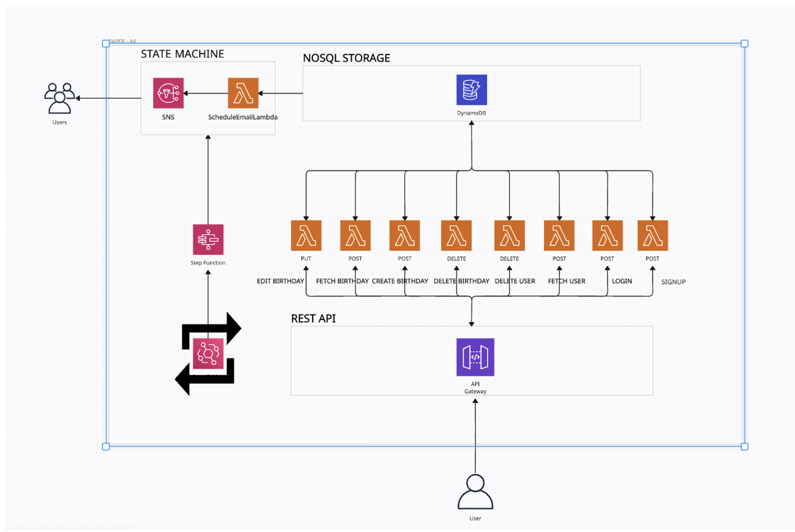

# ReminderApplication-AWS
Reminder Application for Birthdays using AWS Server-less Architecture

## Data Flow Documentation

## References

1. Amazon Web Services, Inc., [AWS CloudFormation](https://aws.amazon.com/cloudformation/). Accessed: April 4, 2024.
2. Amazon Web Services, Inc., [AWS S3](https://aws.amazon.com/s3/). Accessed: April 4, 2024.
3. Amazon Web Services, Inc., [AWS DynamoDB](https://aws.amazon.com/dynamodb/). Accessed: April 4, 2024.
4. Amazon Web Services, Inc., [AWS API Gateway](https://aws.amazon.com/api-gateway/). Accessed: April 4, 2024.
5. Amazon Web Services, Inc., [AWS Lambda](https://aws.amazon.com/lambda/). Accessed: April 4, 2024.
6. Amazon Web Services, Inc., [AWS SNS](https://aws.amazon.com/sns/). Accessed: April 4, 2024.
7. Amazon Web Services, Inc., [AWS IAM](https://aws.amazon.com/iam/). Accessed: April 4, 2024.
8. Amazon Web Services, Inc., [AWS EventBridge](https://aws.amazon.com/eventbridge/). Accessed: April 4, 2024.
9. Amazon Web Services, Inc., [AWS Step Functions](https://aws.amazon.com/step-functions/). Accessed: April 4, 2024.
10. [Boto3 documentation](https://boto3.amazonaws.com/v1/documentation/api/latest/index.html). Accessed: April 4, 2024.
11. ["About Us," Creatly.com](https://creately.com/about-us/). Accessed: April 4, 2024.
